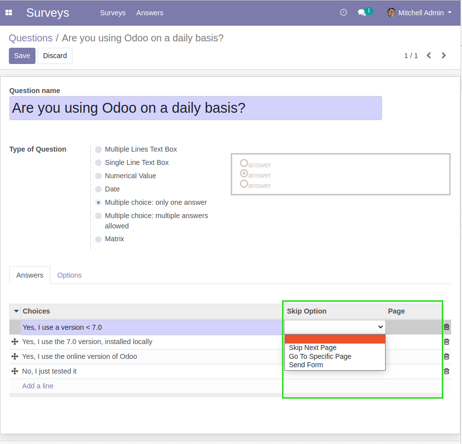
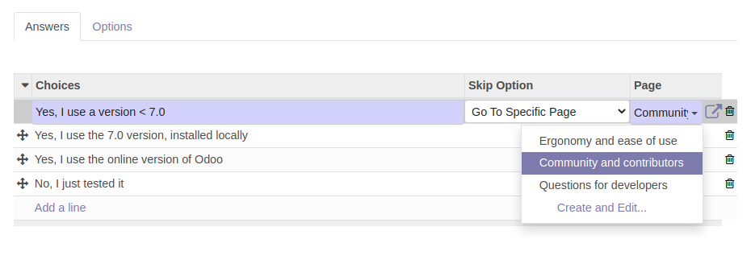
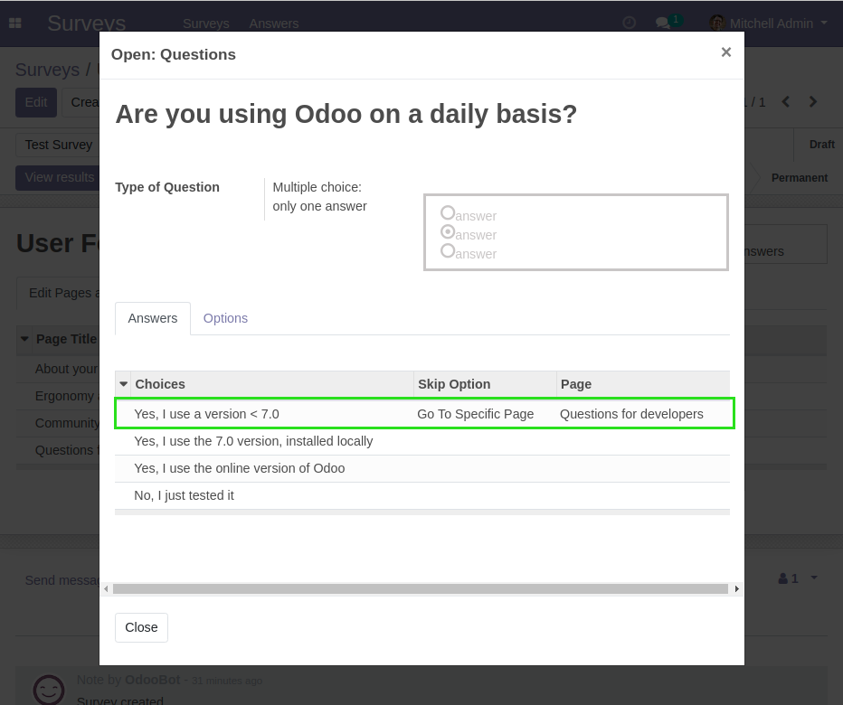
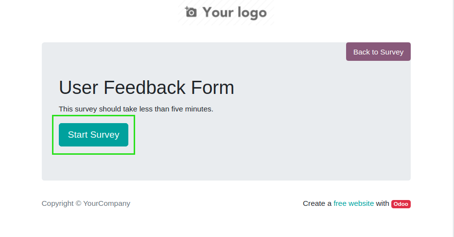
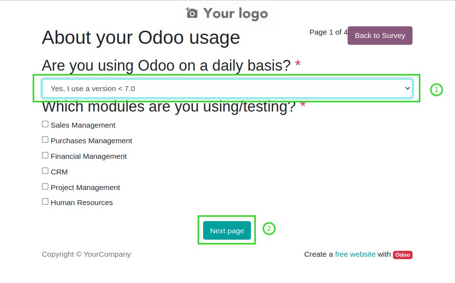
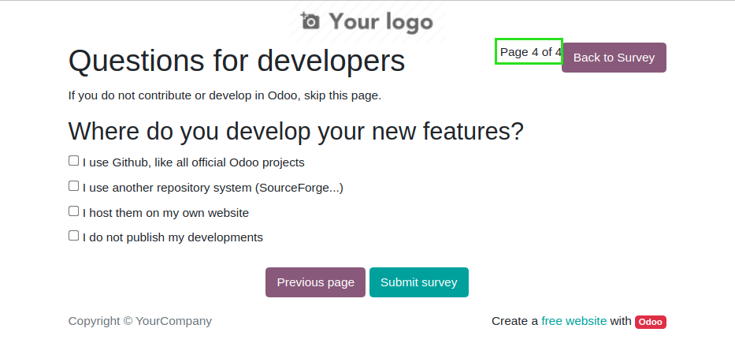

Survey Condition
================

This module allows to skip survey pages based on answers.

.. contents:: Table of Contents

Configuration
-------------
In the form view of a question, the table of answers contains two new columns:

* ``Skip Option``
* ``Page``

The field ``Skip Option`` has three possible values:

* ``Skip Next Page``
* ``Go To Specific Page``
* ``Send Form``

When a user answers this question, the skip option for the selected item is applied.

Skip Next Page
~~~~~~~~~~~~~~
When ``Skip Next Page`` is selected, the next page in the survey is skipped,
whatever that page might be.

Go To Specific Page
~~~~~~~~~~~~~~~~~~~
When ``Go To Specific Page`` is selected, the field ``Page`` becomes editable and required.

When the answer is submitted by a user, all pages between the current page and the target page are skipped.

Send Form
~~~~~~~~~
When ``Send Form`` is selected, after submitting the survey page, all remaining pages are skipped.
The user is redirected to the final page in order to submit the form.

Usage
-----
Suppose the first question of the survey is configured as follow.

As a partner, I begin to fill the survey.

I select the answer with a skip condition. Then I click on ``Next Page``.

I notice that the pages 2 and 3 were skipped.

Contributors
------------
* Numigi (tm) and all its contributors (https://bit.ly/numigiens)

More information
----------------
* Meet us at https://bit.ly/numigi-com
