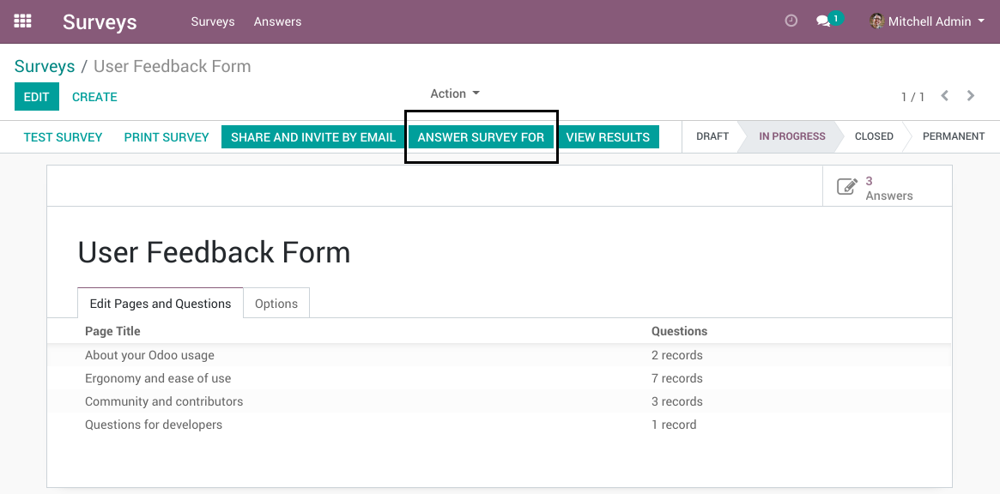

Survey Answer For Partner
=========================
This module enables filling a survey for someone else (likely a customer).

Usage
-----
Go to the form view of a survey.

Then click on the button `Answer Survey For`.

Select the partner for whom to answer the survey and click on `Validate`.

Then, complete and send the survey.

Go back to the form view of the survey. Click on the `Answers` smart button.

Note that the new answer is in the name of the selected partner.

Smart Button On Partners
------------------------
On the form view of a partner, a `Survey Answers` smart button is added.

When clicking on the button, the list of survey answers is displayed.

Contributors
------------
* Numigi (tm) and all its contributors (https://bit.ly/numigiens)

More information
----------------
* Meet us at https://bit.ly/numigi-com
